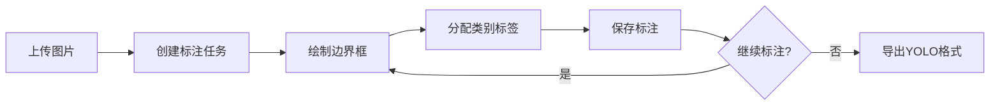
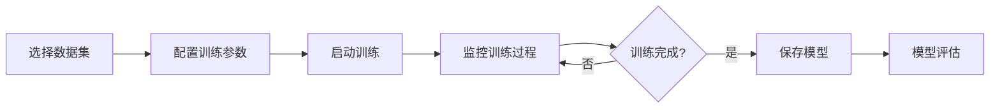
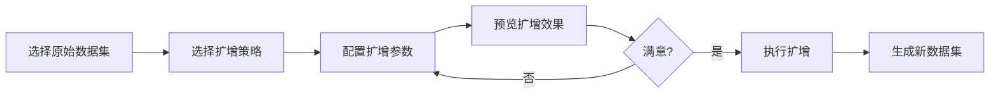

## 1. 产品概述

一款面向无人机航拍场景的YOLO目标检测Web平台，提供图片检测、模型训练、手工标注和数据集管理功能。特别针对小样本（20张超高清图片）场景提供智能数据扩增能力，解决目标不明显、样本稀缺的训练困境。

## 2. 核心功能

### 2.1 用户角色
| 角色 | 注册方式 | 核心权限 |
|------|----------|----------|
| 普通用户 | 直接使用 | 上传图片检测、手工标注、模型训练、数据集管理 |

### 2.2 功能模块
1. **首页工作台**: 功能导航、项目概览、快速操作入口
2. **图片检测页**: 上传图片、YOLO模型推理、检测结果可视化
3. **手工标注页**: 图片上传、边界框标注、类别管理、标注导出
4. **模型训练页**: 训练配置、数据集选择、训练监控、模型管理
5. **数据集管理页**: 数据集浏览、样本扩增、版本管理、导入导出
6. **数据扩增页**: 扩增策略配置、扩增预览、扩增任务管理

### 2.3 页面详情
| 页面名称 | 模块名称 | 功能描述 |
|----------|----------|----------|
| 首页工作台 | 功能导航卡片 | 6大功能入口，图标+文字，悬停动效 |
| 首页工作台 | 统计面板 | 数据集数量、模型数量、标注进度 |
| 图片检测页 | 上传区域 | 拖拽上传、批量上传、图片预览 |
| 图片检测页 | 检测参数 | 模型选择、置信度阈值、NMS阈值 |
| 图片检测页 | 结果展示 | 原图/检测结果对比、边界框叠加、类别标签 |
| 手工标注页 | 画布编辑器 | 图片缩放、拖拽、边界框绘制、快捷键支持 |
| 手工标注页 | 类别管理 | 添加/删除类别、颜色分配 |
| 手工标注页 | 标注列表 | 当前图片所有标注、编辑/删除 |
| 模型训练页 | 训练配置 | epochs、batch size、学习率、预训练模型 |
| 模型训练页 | 训练监控 | 实时loss曲线、mAP指标、进度条 |
| 模型训练页 | 模型列表 | 已训练模型、性能指标、下载/部署 |
| 数据集管理页 | 数据集浏览 | 网格视图、筛选、搜索 |
| 数据集管理页 | 标注统计 | 类别分布、样本数量、标注质量 |
| 数据扩增页 | 扩增策略 | 旋转、翻转、裁剪、色彩变换、Mosaic、MixUp |
| 数据扩增页 | 扩增预览 | 实时预览扩增效果、参数调节 |
| 数据扩增页 | 扩增任务 | 批量扩增、进度监控、结果管理 |

## 3. 核心流程

### 3.1 图片检测流程

### 3.2 手工标注流程

### 3.3 模型训练流程

### 3.4 数据扩增流程

## 4. 用户界面设计

### 4.1 设计风格
- **主色调**: 深空蓝 (#1a1f36) 作为背景，科技蓝 (#3b82f6) 作为主色
- **辅助色**: 翠绿 (#10b981) 表示成功，琥珀 (#f59e0b) 表示警告，玫红 (#ef4444) 表示错误
- **按钮风格**: 圆角矩形 (8px)，轻微阴影，悬停时上浮2px
- **字体**: 标题使用 "Outfit"，正文使用 "Plus Jakarta Sans"
- **布局**: 左侧导航栏 + 顶部面包屑 + 主内容区卡片式布局
- **图标**: Lucide React 图标库，线性风格
- **动效**: 页面切换淡入淡出，卡片悬停微动效，加载骨架屏

### 4.2 页面设计概览
| 页面名称 | 模块名称 | UI元素 |
|----------|----------|--------|
| 首页工作台 | 功能导航卡片 | 6个卡片网格，图标+标题+描述，悬停阴影加深，点击跳转 |
| 图片检测页 | 上传区域 | 虚线边框拖拽区，上传进度条，图片缩略图 |
| 图片检测页 | 结果展示 | 左右分栏对比，Canvas叠加检测结果，可调节透明度 |
| 手工标注页 | 画布编辑器 | 全屏画布，工具栏悬浮，缩放控制，快捷键提示 |
| 模型训练页 | 训练监控 | 实时折线图(Chart.js)，指标卡片，进度环 |
| 数据扩增页 | 扩增策略 | 策略卡片网格，参数滑块，实时预览对比 |

### 4.3 响应式设计
- **桌面优先**: 最小宽度 1280px，最大宽度 1920px
- **平板适配**: 768px-1024px，侧边栏可折叠
- **触摸优化**: 按钮最小 44x44px，拖拽操作支持触摸

### 4.4 特殊视觉元素
- **背景纹理**: 微妙的网格点阵背景 (opacity 0.03)
- **渐变装饰**: 页面顶部使用蓝紫渐变装饰条
- **数据可视化**: 使用 Chart.js 绘制训练曲线和统计图表
- **标注画布**: 深色背景，高对比度标注框，半透明填充