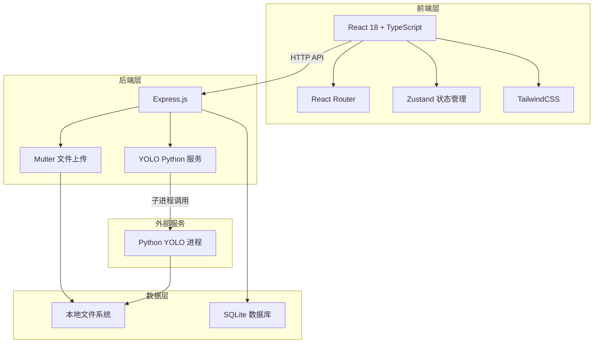
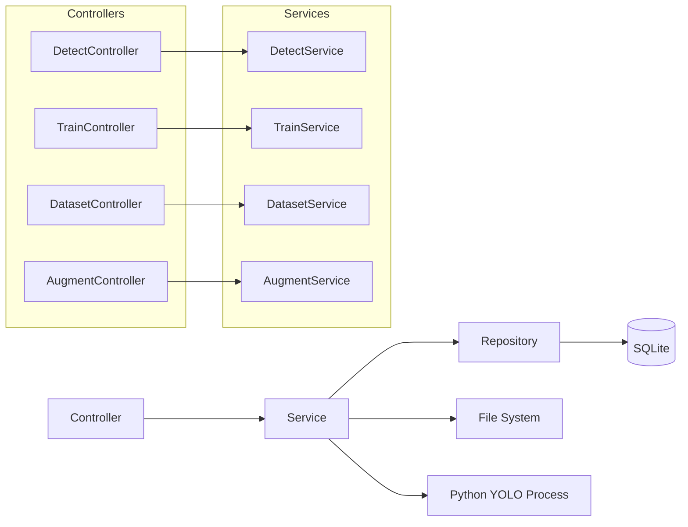
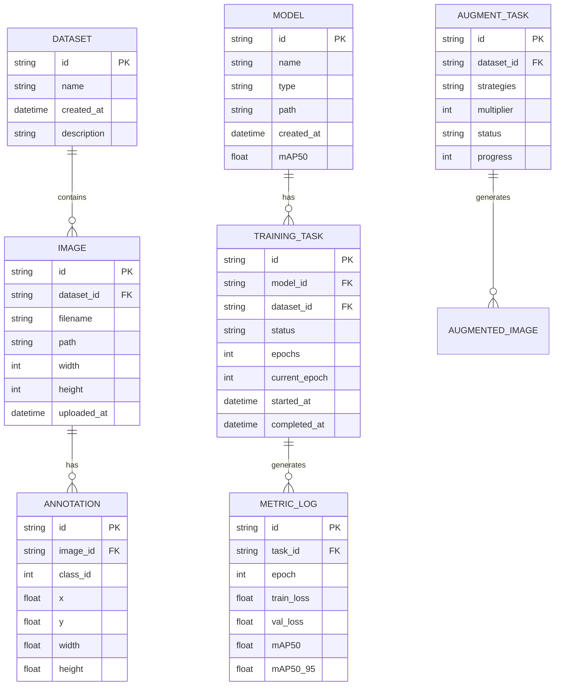

## 1. 架构设计



## 2. 技术栈说明

- **前端**: React 18 + TypeScript + Vite
- **UI框架**: TailwindCSS 3
- **状态管理**: Zustand
- **路由**: React Router DOM 6
- **图标**: Lucide React
- **图表**: Chart.js + react-chartjs-2
- **后端**: Express.js
- **数据库**: SQLite (轻量级，适合本地部署)
- **文件存储**: 本地文件系统
- **YOLO集成**: Python 子进程调用 (ultralytics YOLOv8)
- **数据扩增**: Python OpenCV + Albumentations 库

## 3. 路由定义

| 路由 | 用途 |
|------|------|
| / | 首页工作台，功能导航 |
| /detect | 图片检测页，上传并检测 |
| /annotate | 手工标注页，边界框标注 |
| /train | 模型训练页，配置和监控 |
| /datasets | 数据集管理页，浏览和管理 |
| /augment | 数据扩增页，扩增策略配置 |

## 4. API 定义

### 4.1 图片检测 API
```typescript
// POST /api/detect
interface DetectRequest {
  image: File;
  model_id: string;
  conf_threshold: number;
  iou_threshold: number;
}

interface DetectResponse {
  success: boolean;
  result_image: string; // base64
  detections: Detection[];
  inference_time: number;
}

interface Detection {
  class_id: number;
  class_name: string;
  confidence: number;
  bbox: [number, number, number, number]; // [x1, y1, x2, y2]
}
```

### 4.2 模型训练 API
```typescript
// POST /api/train
interface TrainRequest {
  dataset_path: string;
  model_type: string; // yolov8n, yolov8s, yolov8m, yolov8l
  epochs: number;
  batch_size: number;
  learning_rate: number;
  image_size: number;
}

interface TrainResponse {
  success: boolean;
  task_id: string;
  message: string;
}

// GET /api/train/:task_id/status
interface TrainStatusResponse {
  task_id: string;
  status: 'running' | 'completed' | 'failed';
  progress: number;
  current_epoch: number;
  metrics: {
    train_loss: number;
    val_loss: number;
    mAP50: number;
    mAP50_95: number;
  };
  epochs_log: EpochLog[];
}

interface EpochLog {
  epoch: number;
  train_loss: number;
  val_loss: number;
  mAP50: number;
  mAP50_95: number;
}
```

### 4.3 数据集管理 API
```typescript
// GET /api/datasets
interface DatasetListResponse {
  datasets: Dataset[];
}

interface Dataset {
  id: string;
  name: string;
  image_count: number;
  annotation_count: number;
  classes: string[];
  created_at: string;
}

// POST /api/datasets/upload
interface UploadImagesRequest {
  images: File[];
  dataset_name?: string;
}

// POST /api/datasets/:id/annotations
interface SaveAnnotationRequest {
  image_id: string;
  annotations: Annotation[];
}

interface Annotation {
  class_id: number;
  bbox: [number, number, number, number]; // normalized [x, y, width, height]
}
```

### 4.4 数据扩增 API
```typescript
// POST /api/augment
interface AugmentRequest {
  dataset_id: string;
  strategies: AugmentationStrategy[];
  multiplier: number; // 扩增倍数
}

interface AugmentationStrategy {
  type: 'rotation' | 'flip' | 'crop' | 'color' | 'mosaic' | 'mixup' | 'blur' | 'noise';
  params: Record<string, any>;
}

interface AugmentResponse {
  success: boolean;
  task_id: string;
  estimated_images: number;
}

// GET /api/augment/:task_id/status
interface AugmentStatusResponse {
  task_id: string;
  status: 'running' | 'completed' | 'failed';
  progress: number;
  generated_count: number;
}
```

## 5. 服务器架构图



## 6. 数据模型

### 6.1 数据模型定义



### 6.2 数据定义语言

```sql
-- 数据集表
CREATE TABLE datasets (
  id TEXT PRIMARY KEY,
  name TEXT NOT NULL,
  description TEXT,
  created_at DATETIME DEFAULT CURRENT_TIMESTAMP
);

-- 图片表
CREATE TABLE images (
  id TEXT PRIMARY KEY,
  dataset_id TEXT NOT NULL,
  filename TEXT NOT NULL,
  path TEXT NOT NULL,
  width INTEGER,
  height INTEGER,
  uploaded_at DATETIME DEFAULT CURRENT_TIMESTAMP,
  FOREIGN KEY (dataset_id) REFERENCES datasets(id)
);

-- 标注表
CREATE TABLE annotations (
  id TEXT PRIMARY KEY,
  image_id TEXT NOT NULL,
  class_id INTEGER NOT NULL,
  x REAL NOT NULL,
  y REAL NOT NULL,
  width REAL NOT NULL,
  height REAL NOT NULL,
  FOREIGN KEY (image_id) REFERENCES images(id)
);

-- 模型表
CREATE TABLE models (
  id TEXT PRIMARY KEY,
  name TEXT NOT NULL,
  type TEXT NOT NULL,
  path TEXT NOT NULL,
  mAP50 REAL,
  created_at DATETIME DEFAULT CURRENT_TIMESTAMP
);

-- 训练任务表
CREATE TABLE training_tasks (
  id TEXT PRIMARY KEY,
  model_id TEXT NOT NULL,
  dataset_id TEXT NOT NULL,
  status TEXT NOT NULL,
  epochs INTEGER NOT NULL,
  current_epoch INTEGER DEFAULT 0,
  started_at DATETIME,
  completed_at DATETIME,
  FOREIGN KEY (model_id) REFERENCES models(id),
  FOREIGN KEY (dataset_id) REFERENCES datasets(id)
);

-- 指标日志表
CREATE TABLE metric_logs (
  id TEXT PRIMARY KEY,
  task_id TEXT NOT NULL,
  epoch INTEGER NOT NULL,
  train_loss REAL,
  val_loss REAL,
  mAP50 REAL,
  mAP50_95 REAL,
  FOREIGN KEY (task_id) REFERENCES training_tasks(id)
);

-- 扩增任务表
CREATE TABLE augment_tasks (
  id TEXT PRIMARY KEY,
  dataset_id TEXT NOT NULL,
  strategies TEXT NOT NULL,
  multiplier INTEGER NOT NULL,
  status TEXT NOT NULL,
  progress INTEGER DEFAULT 0,
  created_at DATETIME DEFAULT CURRENT_TIMESTAMP,
  FOREIGN KEY (dataset_id) REFERENCES datasets(id)
);
```