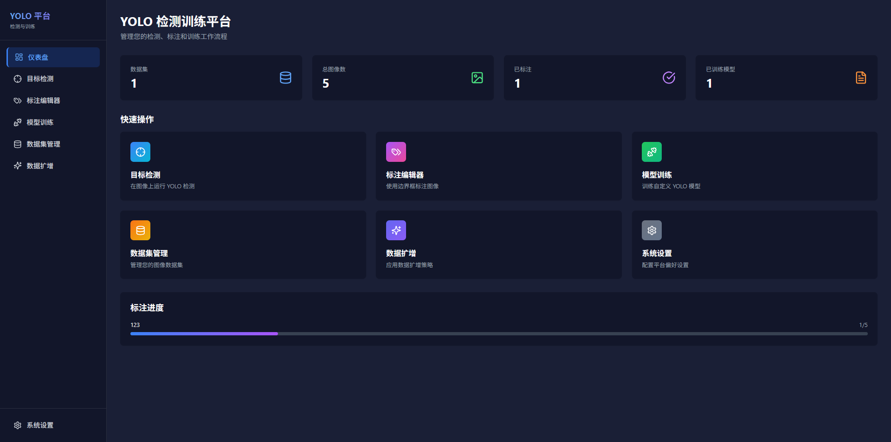

# YOLO 检测训练平台

YOLO目标检测Web平台，提供图片检测、模型训练、手工标注和数据集管理功能。

## 功能特性

- **图片检测**: 上传图片进行YOLO模型推理，可视化检测结果
- **手工标注**: 在线标注工具，支持边界框绘制，导出YOLO格式
- **模型训练**: 配置训练参数，实时监控训练过程
- **数据集管理**: 管理数据集，浏览图片和标注
- **数据扩增**: 多种扩增策略（旋转、翻转、裁剪、色彩变换、Mosaic、MixUp等）

## 效果展示



## 技术栈

### 前端
- React 18 + TypeScript
- TailwindCSS
- Zustand 状态管理
- React Router DOM
- Chart.js 数据可视化
- Lucide React 图标

### 后端
- Express.js
- better-sqlite3 数据库
- Multer 文件上传

### Python 服务
- Ultralytics YOLOv8
- OpenCV
- Albumentations 数据扩增

## 快速开始

### 1. 安装 Node.js 依赖

```bash
npm install
```

### 2. 安装 Python 依赖（可选，用于实际YOLO功能）

```bash
cd python
pip install -r requirements.txt
```

### 3. 启动开发服务器

```bash
npm run dev
```

- 前端: http://localhost:5173
- 后端API: http://localhost:3001

### 4. 构建生产版本

```bash
npm run build
```

## 项目结构

```
gdjyolo/
├── api/                    # 后端代码
│   ├── db/                # 数据库初始化
│   ├── routes/            # API路由
│   └── server.ts          # 服务器入口
├── src/                   # 前端代码
│   ├── api/               # API调用封装
│   ├── components/        # 可复用组件
│   ├── pages/             # 页面组件
│   ├── store/             # 状态管理
│   └── App.tsx            # 应用入口
├── python/                # Python YOLO服务
│   ├── yolo_service.py    # YOLO检测/训练/扩增脚本
│   └── requirements.txt   # Python依赖
├── data/                  # 数据存储
│   ├── uploads/           # 上传文件
│   ├── datasets/          # 数据集
│   ├── models/            # 训练模型
│   └── augmented/         # 扩增数据
└── dist/                  # 构建输出
```

## API 接口

### 数据集管理
- `GET /api/datasets` - 获取所有数据集
- `POST /api/datasets` - 创建数据集
- `POST /api/datasets/:id/images` - 上传图片
- `GET /api/datasets/:id/images` - 获取图片列表
- `POST /api/datasets/images/:imageId/annotations` - 保存标注

### 图片检测
- `POST /api/detect` - 单张图片检测
- `POST /api/detect/batch` - 批量检测

### 模型训练
- `POST /api/train` - 启动训练
- `GET /api/train/:id` - 获取训练状态
- `GET /api/train/models` - 获取模型列表

### 数据扩增
- `POST /api/augment` - 启动扩增任务
- `GET /api/augment/:id` - 获取扩增状态

## 数据扩增策略

平台提供以下扩增策略：

1. **旋转 (Rotation)**: 随机旋转图像，增强目标角度鲁棒性
2. **翻转 (Flip)**: 水平/垂直翻转，增加样本多样性
3. **裁剪 (Crop)**: 随机裁剪，关注局部特征
4. **色彩变换 (Color)**: 调整亮度、对比度、饱和度，适应不同光照
5. **模糊 (Blur)**: 高斯模糊，模拟运动模糊场景
6. **噪声 (Noise)**: 添加高斯噪声，增强模型抗干扰能力
7. **Mosaic**: 4张图片拼接，YOLOv5特色扩增
8. **MixUp**: 两张图片混合，增强泛化能力

建议配置：
- 扩增倍数: 10-20倍（20张 → 200-400张）
- 组合策略: 旋转 + 翻转 + 色彩变换 + 裁剪
- 针对小目标: 增加裁剪比例，保留小目标细节

## 使用说明

1. **数据准备阶段**
   - 上传原始图片
   - 使用标注工具仔细标注所有目标
   - 确保标注质量，避免错误标注

2. **数据扩增阶段**
   - 选择扩增策略：旋转(±30°)、翻转、色彩变换
   - 设置扩增倍数：15-20倍
   - 预览扩增效果，确认质量
   - 执行扩增，生成新数据集

3. **模型训练阶段**
   - 选择YOLOv8n或YOLOv8s（小模型适合小样本）
   - Epochs: 100-200
   - Batch Size: 8-16（根据显存调整）
   - 启用数据增强（Mosaic, MixUp）

4. **检测验证**
   - 使用训练好的模型检测新图片
   - 调整置信度阈值，平衡准确率和召回率
   - 导出检测结果，分析误检/漏检

## License

MIT
